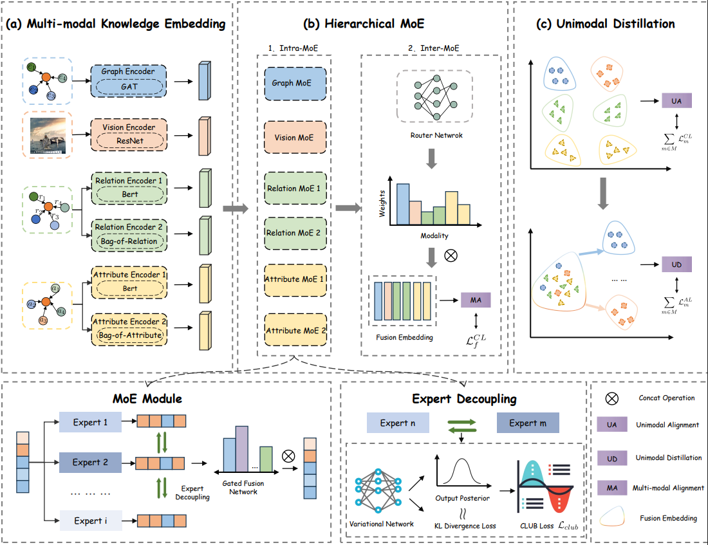

# HUMEA: Modality Weighting and Specificity for Multi-Modal Entity Alignment

Implementation of the AAAI paper **"On Modality Weighting and Specificity for Multi-Modal Entity Alignment"**. This repository provides the code to train and evaluate the Hierarchical Mixture-of-Experts (HUMEA) framework for aligning entities across multi-modal knowledge graphs.



## Table of Contents
- [Background](#background)
- [Features](#features)
- [Repository Structure](#repository-structure)
- [Dataset](#dataset)
- [Environment Setup](#environment-setup)
- [Usage](#usage)
  - [Quick Start](#quick-start)
  - [Reproducing Main Results](#reproducing-main-results)
  - [Ablation and Hyper-Parameter Sweeps](#ablation-and-hyper-parameter-sweeps)
- [Notes](#notes)
- [Citation](#citation)

## Background
HUMEA models multi-modal entity alignment with three core ideas:
1. **Multi-modal knowledge embedding** for text, vision, structure, and attributes.
2. **Hierarchical Mixture-of-Experts** to learn modality-aware fusion weights.
3. **Unimodal distillation** to encourage modality-specific expertise and cross-modal consistency.

## Features
- Hierarchical router with modality-level and expert-level gating.
- Distillation objectives for both unimodal and fused representations.
- Configurable contrastive and alignment losses with temperature controls.
- End-to-end training scripts for the MMKB-based benchmarks (FB15K-DB15K, FB15K-YAGO15K).

## Repository Structure
- `train.py` — main training entry point.
- `run.sh` — single-experiment runner (seed, dataset, alignment rate, fusion dimension, and ablation flags).
- `run_all.sh` — batch script covering main results, ablations, and hyper-parameter sweeps.
- `model.py`, `layers.py`, `loss.py`, `utils.py` — HUMEA model components, layers, losses, and utilities.
- `data_process/` — dataset preprocessing helpers.
- `docs/architecture.svg` — high-level architecture diagram placeholder.

## Dataset
1. Download the processed MMKB datasets and image/text embeddings:
   - **data.zip** (BaiduYun): https://pan.baidu.com/s/1BcPAdaP6nhMPYOGzEKmsIQ (code: `aaai`).
2. Extract the archive and place the contents under `data/` so that paths look like:
   - `data/mmkb-datasets/FB15K_DB15K/...`
   - `data/mmkb-datasets/FB15K_YAGO15K/...`
3. (Optional) Provide custom train ILL files via `--train_ill_path` (see `run.sh`).

## Environment Setup
- Python >= 3.11.
- Install dependencies via your preferred tool. Examples:
  - Using [uv](https://github.com/astral-sh/uv):
    ```bash
    uv sync
    ```
  - Using pip:
    ```bash
    pip install -r <(uv pip compile pyproject.toml)
    ```
    or install directly from `pyproject.toml` with a compatible resolver.

## Usage
### Quick Start
Run a single experiment with the default settings (e.g., FB15K-YAGO15K at 20% alignment, fusion dim 0 meaning default MoE):
```bash
bash run.sh 42 FB15K_YAGO15K 0.2 0 0
```
Arguments correspond to: `seed dataset alignment_rate fusion_weight_dim without_flag [train_ill_path]`.

### Reproducing Main Results
Main configurations are scripted in `run_all.sh`. To reproduce core tables:
```bash
bash run.sh 42 FB15K_DB15K 0.2 512 0
bash run.sh 42 FB15K_DB15K 0.5 0 0
bash run.sh 42 FB15K_DB15K 0.8 0 0
bash run.sh 42 FB15K_YAGO15K 0.2 128 0
bash run.sh 42 FB15K_YAGO15K 0.5 0 0
bash run.sh 42 FB15K_YAGO15K 0.8 0 0
```
Logs will be stored under `log/` if you redirect output (see `run_all.sh` for examples).

### Ablation and Hyper-Parameter Sweeps
`run_all.sh` also includes commands for:
- **Component ablations** using the `without_flag` argument (values 1–8 disable specific modules or alignment variants).
- **Loss weight sweeps** by setting `AL_LOSS` or `CL_LOSS` environment variables.
- **Temperature sweeps** via `TAU_AL` and `TAU_CL` environment variables.

Execute selected blocks from `run_all.sh` or run the full suite:
```bash
bash run_all.sh
```
The script waits for GPU availability between jobs via `nvidia-smi` polling.

## Notes
- Pretrained PLMs referenced in the paper can be obtained from HuggingFace (e.g., `bert-base-uncased`, `xlm-roberta-base`, `albert-base-v2`, `chatglm2-6b`, `llama-7b-embeddings`).
- Adjust batch size (`--bsize`), contrastive temperatures (`--tau_cl`, `--tau_al`), and checkpoint frequency (`--check_point`) in `run.sh` as needed for your hardware.
- Ensure image embeddings in the dataset match the preprocessing described in MMKB (VGG16-extracted features).

## Citation
If you find this work useful, please cite:
```
@inproceedings{humea2025,
  title     = {On Modality Weighting and Specificity for Multi-Modal Entity Alignment},
  booktitle = {Proceedings of the AAAI Conference on Artificial Intelligence},
  year      = {2025}
}
```
